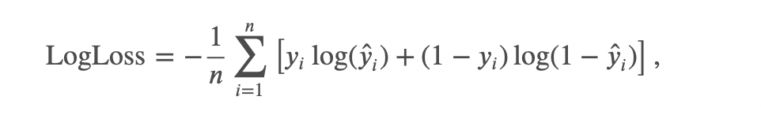
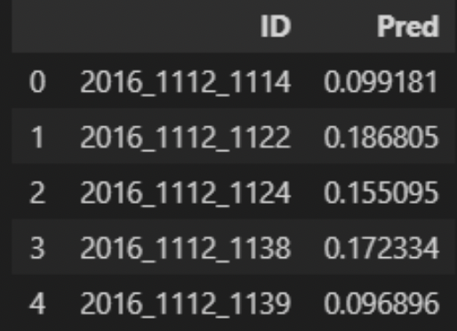

# MarchMadness
## Context
This repository contains all the code I implemented for the 2022 March Madness. An annual competition sponsored by **Kaggle** which goal is to predict the outcomes of the US men's college basketball tournament. In order to do so, Kaggle provides us historical NCAA games data.

The challenge is divided into 2 parts :
 - Train a model to predict tourney results on the previous years (2016-2021).
 - Predict 2022 results

## First Part

 After Selection Sunday, **68 teams** have been selected.Results are expected on the last 5 editions : **2016, 2017, 2018, 2019 & 2021**
I had to predict all 67*68/2 = **2278** possible combinations per year.

The file to be submitted consists of a DataFrame with the match ID consisting of the year and team ids (year_id1_id2), the probability that team Id1 wins,a total of 5*2278 = 11 390 matches

The **score** is computed with the Log Loss :

### My method

(_The datasets given by Kaggle where clean and ready to be used, no Data Cleaning was required_)

#### Features engineering
Here an exemple of steps you can find in the features engineering part :
 - I deleted the conference from the seed because irrelevant
 - I computed the APBR Metrics for all team,  Metrics to provide an _“Analysis of basketball through objective evidence”._ (APBRMETRICS : apbr.org/metrics)
 (examples : Number of Wins / Losses, Win Percentage, Number of Possessions, Average Score Margin,Number of points per possession
####Benchmarking of predictive models

Here is table that sums up the results I had :

####Final Prediction with the best model

So the best model to chose was the **XGBoost with K-Fold Cross Validation**

Here is a screenshot of what my submission file looked like, with the `ID` of each team and the `Pred` that the first team wins

